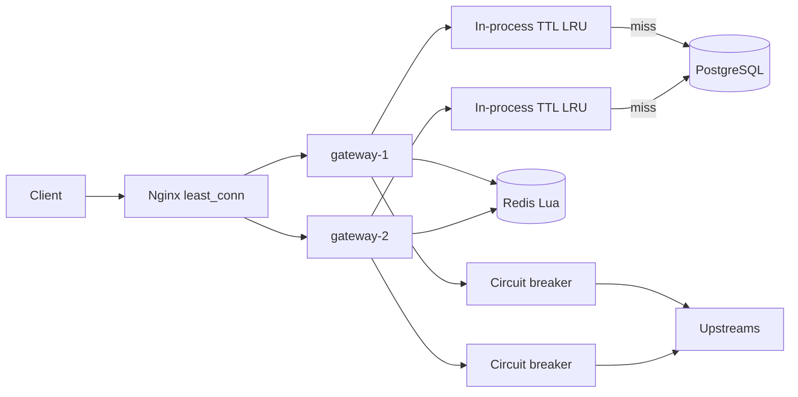

# Architecture

## Why this shape

A rate limiter that must be correct under concurrent requests and multiple processes cannot keep counters in Node.js memory. Two gateway instances would each allow a full quota.

PostgreSQL *can* store counters, but every request would take a row lock or an `UPDATE` on a hot row. That becomes the bottleneck long before Node.js does.

Redis is used because:

- INCR / hash / sorted-set operations are O(log N) or better in memory
- Lua runs atomically on the Redis thread: no `GET → calculate → SET` race
- TTL expires idle keys so unused tenants do not leak memory

The API process is stateless so Nginx can send any request to any instance. The only shared write state on the hot path is Redis.

## Diagram



## Request flow

1. Nginx adds `X-Request-ID` / `X-Forwarded-For` and picks an instance (`least_conn`).
2. The instance assigns a correlation ID (pino request log + `X-Request-ID`).
3. `/admin/v1/*` uses `X-Admin-Key` (constant-time compare). Everyone else is a gateway request.
4. Gateway extracts `X-API-Key` or `Authorization: Bearer`. The tenant is **only** taken from the authenticated key row. A body/header `tenant_id` is ignored for authorization.
5. API-key cache (TTL LRU) → on miss, lookup by `key_prefix`, SHA-256(`pepper + plaintext`), `timingSafeEqual` on hashes.
6. Route/policy/upstream cache → on miss, load tenant routes from PostgreSQL, match path/method (longest specificity wins), load policy + upstream. Cross-tenant FKs are rejected.
7. Dimension tuple (`tenant`, `api_key`, `route`, `ip`, `custom` header) is hashed into a Redis key that also embeds `policy.version`.
8. One Lua script mutates Redis and returns `allowed`, `remaining`, `retry_after_ms`, `reset`.
9. On allow: circuit breaker `canPass()`; if open → `503`. Else reverse-proxy with route/upstream timeout.
10. Upstream 5xx, timeout, or connect failure records a breaker failure. Success records a success (half-open → closed).
11. Response headers: `RateLimit-Limit`, `RateLimit-Remaining`, `RateLimit-Reset`, and `Retry-After` on 429/503.

Admin traffic never goes through the rate-limit Lua path.

## Redis key design

```
rl:{algorithm}:{tenantId}:{policyId}:v{version}:{sha256(dimensions)[0:32]}
```

| Algorithm | Redis type | Fields |
| --- | --- | --- |
| Token bucket | HASH | `tokens`, `ts` |
| Sliding window | ZSET | score = Redis TIME ms, member = unique request id |

`PEXPIRE` is set on every decision so idle keys disappear.

Policy changes increment `policies.version`. New decisions use a new key; old keys expire. That is how limit changes take effect without a Redis `FLUSH`.

Clock: Lua calls `TIME` inside the script. Instances do not trust their own wall clocks for the decision.

## Lua algorithms

### Token bucket

State: remaining tokens and last refill timestamp.

```
tokens = min(capacity, tokens + elapsed_ms * refill_rate_per_sec / 1000)
if tokens >= cost: tokens -= cost; allow
else: deny; retry_after = missing / rate
```

`burstCapacity` is the bucket size. `refillRatePerSec` is the sustained rate. This is the standard “burst then settle” limiter.

### Sliding window (precise)

```
ZREMRANGEBYSCORE key 0 (now - window)
count = ZCARD
if count < limit: ZADD now member; allow
else: deny; retry_after = oldest + window - now
```

Correct and easy to explain. Memory is **one ZSET entry per allowed request in the window**. At very high QPS per key, an approximate window (two counters + weighted current/previous bucket) uses constant memory. This project uses the precise version deliberately.

Lua is required because `ZREMRANGEBYSCORE` + `ZCARD` + `ZADD` must be one atomic decision. Two pipelined commands from Node.js can interleave: both see `count = limit-1` and both add.

## Caching trade-off

Intended hot path:

```
request → local cache → (miss) PostgreSQL → Redis decision → upstream
```

vs a simpler design that queries PostgreSQL on every request:

| | Local cache | Postgres every request |
| --- | --- | --- |
| Latency | microseconds after warmup | 1–5+ ms + pool contention |
| Consistency | stale up to TTL (5s default) | read-your-writes on that instance |
| Revocation delay | up to API-key cache TTL | immediate |
| Failure | cache hit survives brief PG blip | every request fails if PG is down |

This project: **TTL + bounded LRU + invalidate on the instance that handled the admin write**. Other instances wait out TTL.

Redis is **not** used for config. That keeps “Redis = rate-limit state only”.

Later scale-up: PostgreSQL `LISTEN/NOTIFY` (or a version row) so every instance drops cache entries without shortening TTL. Not implemented; documented because it is the usual next step.

## Circuit breaker vs rate limiter

They solve different problems:

- Rate limiter: protect **your** quota / fairness (tenant A cannot starve tenant B).
- Circuit breaker: protect **this process** from a dying upstream (fail fast, give it time to recover).

Order in this codebase: **rate limit first, then breaker, then proxy**. A rejected 429 never hammers a sick upstream. An open circuit returns 503 even if the tenant still has tokens.

The breaker is **in-process**. That is correct for “stop sending from *this* connection pool”. A distributed breaker in Redis would synchronize OPEN across instances; it is not required to demonstrate the pattern and would mix concerns with rate-limit keys.

## Concurrency model

- Node.js is single-threaded for JS. The hot path is async I/O: Redis, then upstream.
- Correctness under concurrency comes from Redis single-threaded Lua, not from Node locks.
- `pg.Pool` and ioredis multiplex sockets. Saturating the event loop (huge JSON, sync crypto on a hot path) increases `gateway_eventloop_lag_seconds` (and prom-client's default `gateway_nodejs_eventloop_lag_seconds`) and tail latency.
- API keys are high-entropy; SHA-256 + pepper is used instead of bcrypt so auth stays off the event-loop budget.

## Observability

`/metrics` is Prometheus text format. Compose scrapes both instances. Grafana loads `grafana/dashboards/gateway.json`.

Structured logs via pino include `requestId` and `instance`. Health:

- `GET /health/live` — process is up
- `GET /health/ready` — PostgreSQL `SELECT 1` and Redis `PING`

Graceful shutdown: `SIGTERM`/`SIGINT` stop accepting, then close Redis and the PG pool, with `SHUTDOWN_DRAIN_MS` as a hard deadline.
