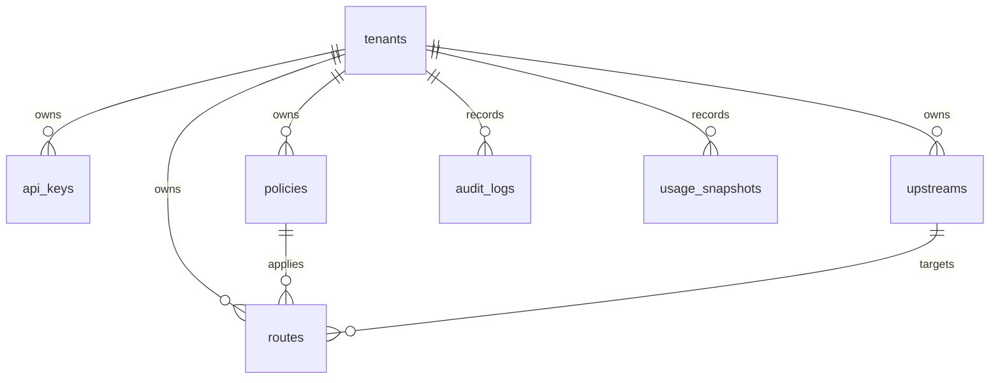

# Database schema

PostgreSQL is authoritative for configuration and audit. Migrations live in `src/db/migrations/001_initial.sql` and are applied by `src/db/migrate.ts` (table `schema_migrations`).

## ERD

## Tables

### tenants

| Column | Notes |
| --- | --- |
| id | UUID PK |
| slug | unique public name |
| name | display |
| status | `active` \| `suspended` |
| created_at, updated_at | timestamptz |

Suspended tenants fail closed at auth (`403`), not at Redis.

### api_keys

| Column | Notes |
| --- | --- |
| id | UUID PK |
| tenant_id | FK, indexed |
| name | operator label |
| key_prefix | unique, used only to narrow lookup |
| key_hash | unique SHA-256(`pepper \|\| plaintext`) |
| status | `active` \| `revoked` |
| expires_at | optional |
| last_used_at | best-effort, never on the critical path after auth cache |
| revoked_at | set on revoke/rotate |

Plaintext is returned **once** on create/rotate. Rotation inserts a new row and revokes the old one.

### policies

| Column | Notes |
| --- | --- |
| algorithm | `token_bucket` \| `sliding_window` |
| limit_count | sliding-window max events |
| window_ms | sliding-window width; also influences TB TTL |
| refill_rate_per_sec | token-bucket sustained rate |
| burst_capacity | token-bucket size |
| dimensions | `text[]` of `tenant`, `api_key`, `route`, `ip`, `custom` |
| custom_header | used when `custom` is present (seed: `x-user-id`) |
| fail_mode | `fail_closed` \| `fail_open` |
| version | incremented on every update; embedded in Redis keys |

One algorithm per policy. Combinations are data, not separate code paths.

### upstreams

`base_url`, `timeout_ms`, and circuit-breaker knobs: `cb_failure_threshold`, `cb_recovery_ms`, `cb_half_open_max_probes`.

### routes

`path_pattern` (`/api/orders/:id`), `method` (`*` or a verb), `policy_id`, `upstream_id`, optional `timeout_ms` override, optional `strip_prefix`.

Admin create/update loads policy and upstream **with `tenant_id`** so tenant A cannot attach tenant B’s policy.

### audit_logs

Every admin mutation writes `actor`, `action`, `resource_type`, `resource_id`, `payload`.

### usage_snapshots

Durable rollup table (`allowed_count`, `rejected_count` per tenant/route/window). The hot path does **not** write this table; request volume lives in Prometheus. The table exists for later batch jobs and interview discussion: writing PG on every request would reintroduce the bottleneck we avoided.

## Indexes and pooling

Indexes: tenant FKs, `api_keys(key_prefix, status)`, `routes(tenant_id, status, method)`, audit/usage time.

`pg.Pool`: `PG_POOL_MAX`, idle timeout, connection timeout, `statement_timeout` on transactional connections. Exhaustion shows up as connection timeouts, not as hung sockets forever.
